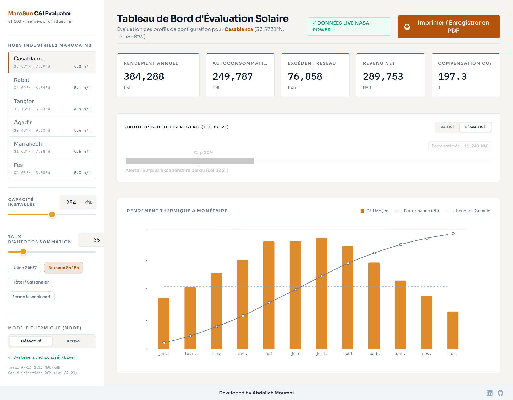

# MaroSun C&I Evaluator

[](#)
[](#)

MaroSun C&I Evaluator is a high-density, tech-economic solar valuation monorepo built to analyze and appraise Commercial & Industrial (C&I) solar installations under the Moroccan regulatory framework. The system interfaces dynamically with historical meteorological data streams and computes instant, audit-ready financial yields and carbon offset summaries.

## Business Value & Use Case

This tool bridges the gap between complex solar engineering and business decision-making by providing instant financial ROI and carbon offset metrics for commercial solar projects in Morocco.

## Screenshots / Demo



---

## ⚡ Core Technical Architecture

The platform is organized as a clean, decoupled monorepo workspace:

```text
marosun-ci-evaluator/
├── backend/                  # FastAPI Application Gateway
│   ├── app/
│   │   ├── constants.py      # Moroccan regulatory and spatial markers
│   │   ├── solar_engine.py   # Analytical math & Law 82-21 clipping rules
│   │   └── main.py           # API endpoints & async NASA HTTP client
│   └── requirements.txt      # Python dependencies
└── frontend/                 # React UI Engineering Cockpit
    ├── src/
    │   ├── components/       # Layout and presentation views
    │   │   ├── HubSelector.jsx
    │   │   ├── KpiCards.jsx
    │   │   ├── SolarChart.jsx
    │   │   └── PrintButton.jsx
    │   ├── App.jsx           # Reactive dashboard core & API fetch bridge
    │   └── index.css         # Tailwind CSS v4 layout configurations
    └── vite.config.js        # Native bundler plugin setups

```

---

## 📐 Mathematical & Regulatory Framework

The calculation engine handles live parameter sweeps according to constraints set by the Moroccan grid operator and national legislation:

### 1. Energy Yield Formulations

The system evaluates total annual AC generation using a standard system loss ratio coefficient:

$$E_{AC} = P_{kWp} \times PSH \times 0.78$$

* Where $P_{kWp}$ represents the target DC plant sizing capacity.
* $PSH$ represents cumulative annual Peak Sun Hours calculated directly from location-specific daily Global Horizontal Irradiance (GHI) timeseries matrices.
* **0.78** represents the fixed Performance Ratio baseline for commercial grid-tied systems.

### 2. Law 82-21 Grid Injection Ceiling

In strict accordance with **Law 82-21 (Article 17)** governing electrical self-consumption networks, total grid-injected surplus energy is tightly monitored and restricted:

* **Surplus Allocation:** Generated power is split according to the customer operational self-consumption index:

$$E_{Self} = \alpha \times E_{AC}$$


$$E_{Surplus} = (1 - \alpha) \times E_{AC}$$


* **The 20% Clipping Penalty:** Net injection allowed back into the national grid mix cannot exceed 20% of total annual production. Any surplus generation matching $E_{Surplus} > 0.20 \times E_{AC}$ is truncated, marked as lost system curtailment, and stripped from financial revenue logic.

### 3. Integrated Tariff Baselines

* **Self-Consumption Offset Value:** 1.10 MAD/kWh (Grid parity savings value).
* **Surplus Grid Injection Credit:** 0.195 MAD/kWh (Average national net-metering baseline value).
* **Avoided Carbon Profile:** 0.604 kg CO₂/kWh utilized (Moroccan national grid emission mix factor).

---

## 🚀 Local Installation & Deployment

### Prerequisite Dependencies

Ensure you have **Python 3.10+** and **Node.js 18+** installed on your system workspace.

### 1. Backend Service Launch

Open a separate terminal window and run:

```bash
# Navigate into backend workspace
cd backend

# Install dependencies
pip install -r requirements.txt

# Start the local development server
python -m uvicorn app.main:app --reload

```

The API engine will spin up at `http://127.0.0.1:8000`. You can audit active endpoint mappings and test raw payload queries using the auto-generated documentation suite at `http://127.0.0.1:8000/docs`.

### 2. Frontend Interface Launch

Open a second terminal window alongside the backend runner:

```bash
# Navigate into frontend workspace
cd frontend

# Install package tree
npm install

# Run native Vite live development engine
npm run dev

```

The client UI cockpit will spin up locally at `http://localhost:5173/`.

---

## 📋 Target Feature Inventory

* **Asynchronous External Telemetry Pipelines:** Integrates non-blocking HTTPX async routines to pull real-time historical calendar blocks from the NASA POWER Meteorology repository.
* **Dynamic Engineering Dashboard:** Screen-locked workspace layout featuring a highly interactive UI with user-configurable sliders for system sizing and self-consumption rates (replacing hardcoded values). These controls instantly recalculate financial yields and injection penalties in real-time.
* **Dual-Axis Composed Analytical Graphs:** Built with Recharts to plot monthly solar radiation curves alongside running cumulative monetary valuations on independent relative vertical axes.
* **Print Layout Overrides:** Standardized print styles that automatically format data configurations into a clean evaluation report when generating PDFs or physical documents.

```

```